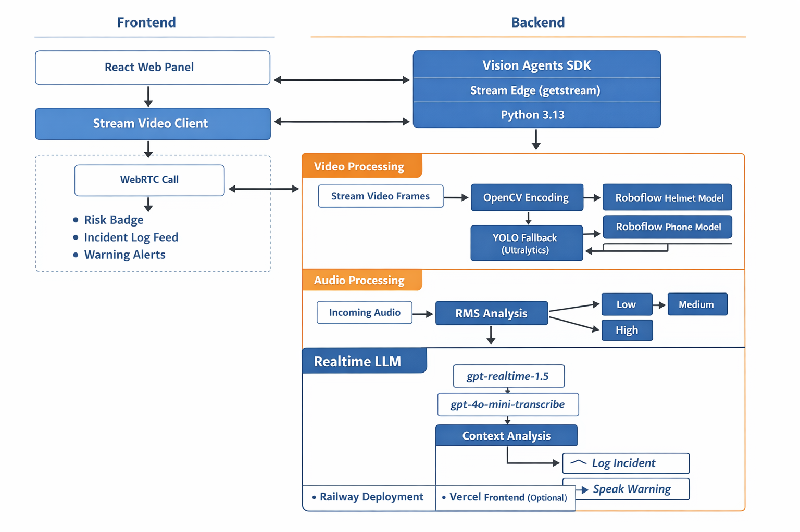

# Sentinel AI
Real-Time Multimodal Safety Agent built with Vision Agents SDK.

## Overview
Sentinel AI monitors live video and audio streams, detects workplace safety violations, classifies risk severity, and logs incidents in real time using LLM reasoning and tool calling.

## Core Detection Scenarios
1. Helmet not worn -> `HIGH` risk
2. Phone detected -> `MEDIUM` risk
3. Loud sound detected -> `LOW`, `MEDIUM`, or `HIGH` risk

## Tech Stack
| Layer | Technology |
|---|---|
| Agent Framework | Vision Agents SDK |
| Realtime Transport | Stream Video (`getstream.Edge`) |
| Reasoning | OpenAI Realtime (`gpt-realtime-1.5`) |
| Vision Detection | Roboflow (helmet + phone), YOLO fallback |
| Audio Detection | NumPy RMS processor |
| Media Processing | OpenCV, AV |
| Frontend | React + `@stream-io/video-client` |
| Deployment | Railway (backend), Vercel (frontend) |

## Architecture
```text
Camera + Mic (Frontend)
        |
        v
Stream Call (shared call ID)
        |
        +--> Sentinel Agent (Vision Agents SDK)
              |
              +--> Video processor -> Roboflow helmet/phone inference
              +--> Audio processor -> RMS noise risk
              +--> OpenAI Realtime reasoning + tool-calling
              |
              +--> Custom events: incident_log, risk_status, warning
        |
        v
React Incident Panel (newest-first logs + summary)
```

## Local Run (Judge-Friendly)
Run from repo root.

### 1) Setup
```powershell
py -3.13 -m venv .venv
.\.venv\Scripts\Activate.ps1
python -m pip install --upgrade pip
python -m pip install -e .
Copy-Item examples/10_sentinel_ai/.env.example .env
```

Fill real keys in `.env`:
- `STREAM_API_KEY`
- `STREAM_API_SECRET`
- `OPENAI_API_KEY`
- `ROBOFLOW_API_KEY`

### 2) Start backend
```powershell
.\.venv\Scripts\Activate.ps1
python examples/10_sentinel_ai/sentinel_ai.py run --no-demo --call-id sentinel-live-001 --log-level info
```

### 3) Start frontend (new terminal)
```powershell
.\.venv\Scripts\Activate.ps1
python examples/10_sentinel_ai/frontend/dev_server.py
```

### 4) Open app
- `http://localhost:5500/preview.html`

In UI:
1. Enable `Helmet Mode (send camera to agent)`
2. Click `Connect to Call`
3. Click `Start Monitoring`

## Judge Test Checklist
1. No helmet in camera -> incident log shows `HIGH` + helmet type
2. Hold phone visibly -> incident log shows `MEDIUM` + phone type
3. Clap/loud sound -> incident log shows sound type + risk
4. Click `Generate Summary` -> summary entry appears in incident log

## Project Highlights
- Real-time multimodal safety monitoring (video + audio)
- Live incident feed and risk status updates
- Tool-calling for autonomous logging and warning workflows
- False-positive controls for phone detection:
  - confidence threshold
  - person-required gate
  - multi-frame confirmation

## Known Limitations
- Internet is required (Stream + Roboflow APIs)
- Accuracy depends on camera angle, lighting, and model quality
- Frontend/backend must use the same call ID, otherwise incidents will not appear
- Realtime session can drop on unstable networks

## Security Note
- `.env` is ignored and should never be committed
- Use `.env.example` as the template for public setup
- Rotate API keys immediately if exposed

## How Risk Classification Works
Sentinel AI combines processor signals from vision and audio before invoking LLM reasoning:
1. Vision processors detect helmet/phone events.
2. Audio processor computes RMS loudness bands.
3. Structured event payload is sent to the LLM.
4. LLM classifies risk (`LOW`, `MEDIUM`, `HIGH`) and calls tools:
   - `log_incident`
   - `speak_warning`
5. Frontend receives `incident_log` and `risk_status` custom events in real time.


## Architecture Image (Optional)

